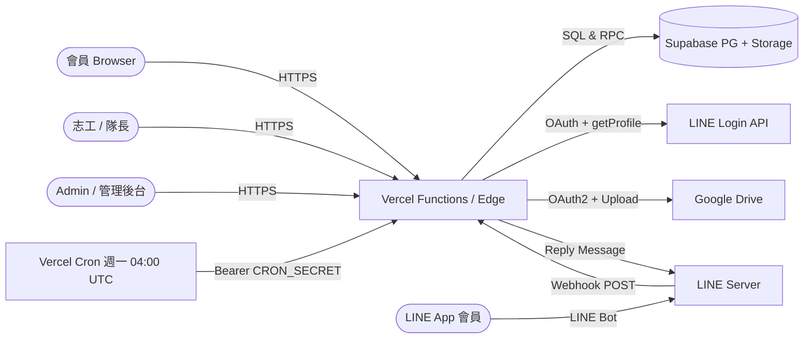
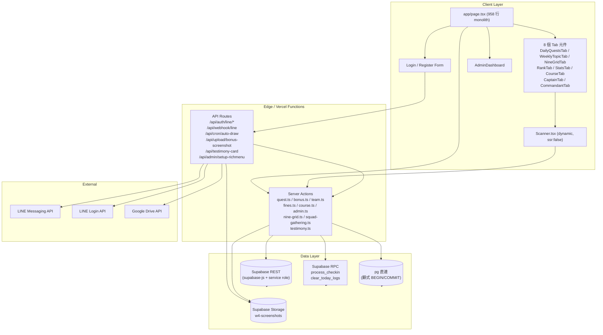
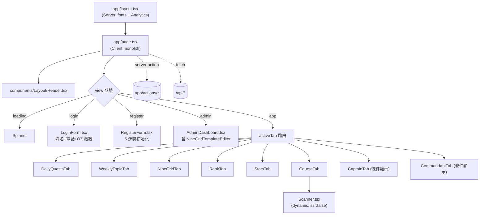
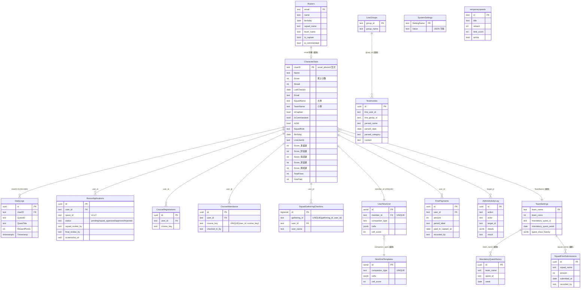
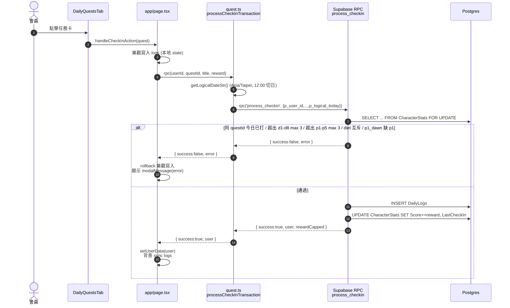
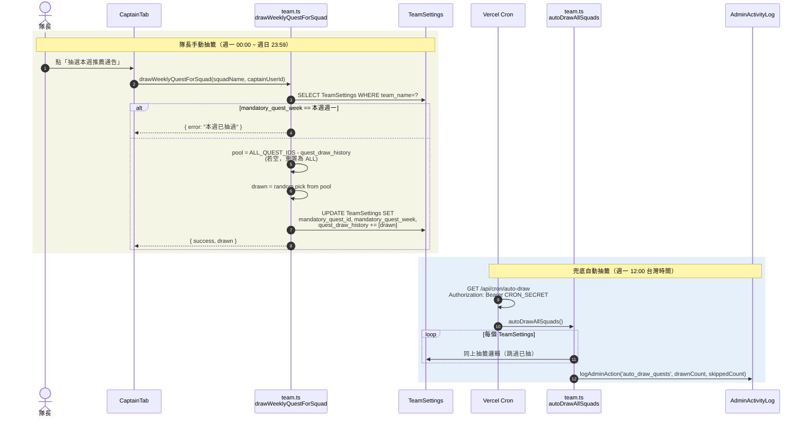
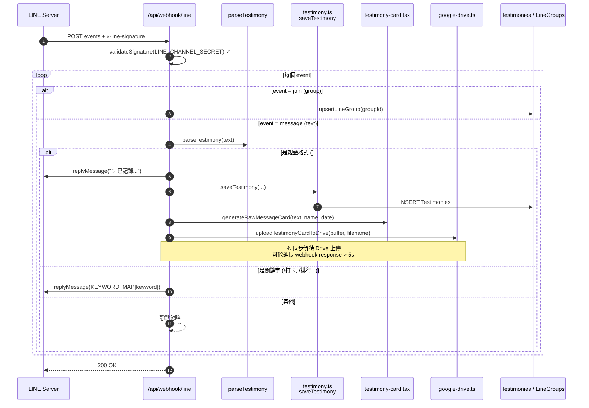
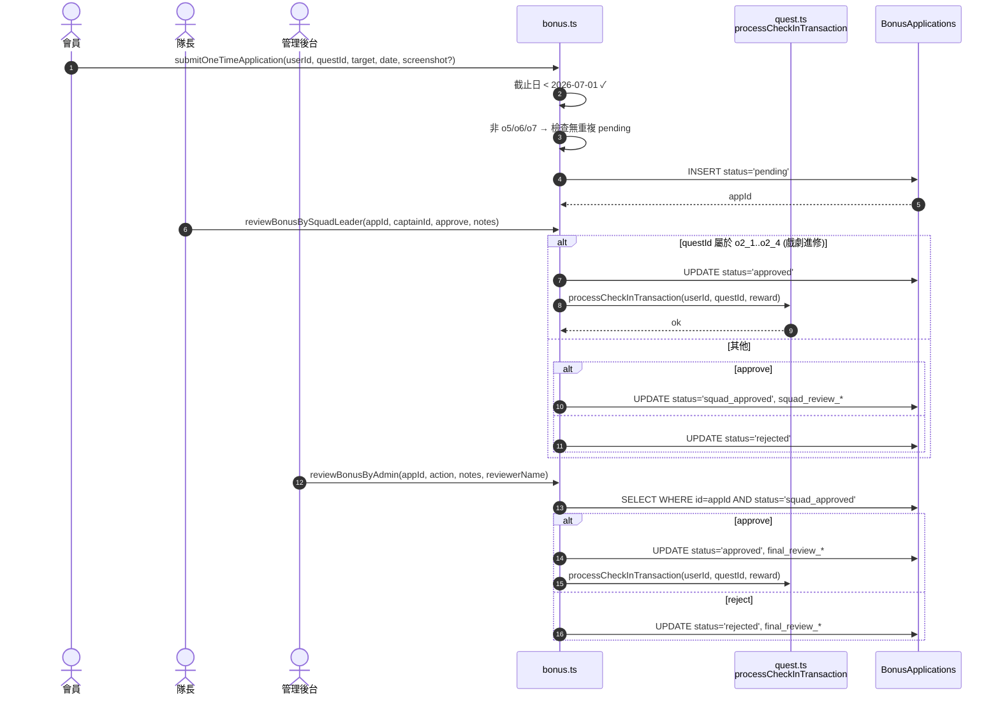
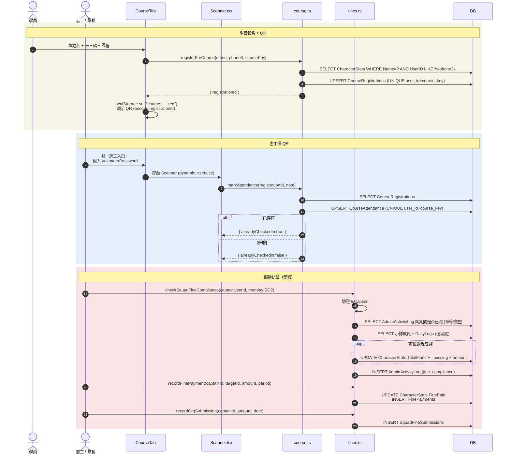

# 覺醒體系開運親證班 — 全端架構與風險評估

> 與 [GAME_DESIGN.md](GAME_DESIGN.md)（遊戲規則 SoT）並列，本文件為**技術 SoT（Source of Truth）**。
>
> 文件目的：(1) 讓新加入的工程師能在一小時內掌握系統全貌；(2) 在 2026-05-10 開營前盤點 200 人並行使用的結構性風險；(3) 提供可立即執行的修補優先序。
>
> 撰寫基準日：2026-04-18。涵蓋 commit `f2ed6d9` 之前的所有程式碼。

---

## 目錄

1. [系統概覽](#1-系統概覽)
2. [軟體架構圖](#2-軟體架構圖)
3. [資料模型 ER 圖](#3-資料模型-er-圖)
4. [核心業務流程](#4-核心業務流程)
5. [函式關係圖](#5-函式關係圖)
6. [200 人並行壓力與效能評估](#6-200-人並行壓力與效能評估)
7. [200 人並行資安評估](#7-200-人並行資安評估)
8. [修補建議優先序](#8-修補建議優先序)
9. [驗證方式](#9-驗證方式)

---

## 1. 系統概覽

**覺醒體系開運親證班（mirror）** 是一套為「2026覺醒開運親證班」實體課程設計的**遊戲化簽到系統**。會員以「黃磚路（Wizard of Oz）」為意象，每日完成基礎修練（d1–d8）、加重修練（p1–p5）、飲食控制（diet_*）、每週課題（wk1–wk4）、一次性任務（o1–o7）等項目來累積 Score（旅程分數）。系統同時支援小隊（隊長）、大隊（大隊長）的層級審核流程。

**生命週期**：
- 開營：**2026-05-10**
- 結營：**2026-07-12**
- 一次性任務截止：**2026-07-01**

**使用者規模**：約 200 名學員，分為多個小隊（約 4 人 / 隊）與大隊。

### 1.1 技術棧

| 層級 | 技術 |
|---|---|
| 前端 | Next.js 16 App Router、React 19、Tailwind CSS 4、Lucide React、html5-qrcode |
| 後端 | Next.js Server Actions、API Route Handlers、Vercel Cron |
| 資料庫 | Supabase（PostgreSQL）+ RPC functions（PL/pgSQL）+ Supabase Storage |
| 直連 DB | `pg` (node-postgres)，用於需要顯式 BEGIN/COMMIT 的場景 |
| 身分驗證 | LINE Login OAuth + HttpOnly cookie（2 分鐘 handoff）+ localStorage（30 分鐘 session）|
| 訊息整合 | LINE Messaging API（Bot）、LINE Login |
| 檔案存放 | Google Drive API（OAuth2 refresh token）、Supabase Storage |
| 部署 | Vercel（含 Vercel Analytics） |
| 監控 | Vercel Analytics（無自定義 APM） |

### 1.2 部署拓撲（C4 Context）



整套系統只有一個 Next.js 專案，沒有獨立後端。所有伺服端邏輯走 **Server Actions**（`app/actions/*`）或 **Route Handlers**（`app/api/**/route.ts`）。

---

## 2. 軟體架構圖

### 2.1 系統分層



#### 兩種 DB Access Pattern 並存

專案刻意保留兩條 DB 路線：

1. **`lib/db.ts` → `pg` 直連**：用於需要明確 `BEGIN/COMMIT/ROLLBACK` 與多步驟 SQL 的情境，目前主要在 [admin.ts](../app/actions/admin.ts)（`checkWeeklyW3Compliance`、`autoAssignSquadsForTesting`、`importRostersData`）與 [fines.ts](../app/actions/fines.ts)（`recordFinePayment`、`checkSquadFineCompliance`）。重點是 [`connectDb()`](../lib/db.ts) **每次 request 建立一個 `Client`**（不池化），原因註解寫在 `lib/db.ts:7-9`：避免在 Vercel serverless 環境下，多個 invocation 各自持 Pool 而把 Supabase 連線數打爆。caller **必須** 在 `finally` 呼叫 `client.end()`。

2. **`@supabase/supabase-js`（service role）**：用於不需要交易語意的單表 read / upsert，以及呼叫 RPC。`process_checkin` 因為核心扣款 / 入帳邏輯都包在 SQL 函式裡，行鎖在 SQL 內完成，因此前端走 supabase-js 即可。

**設計取捨**：這個雙軌讓開發效率高（簡單操作走 supabase-js），但維護者必須清楚每個 server action 用哪一條，以免混用導致鎖等待或連線爆量。

#### 為何 `app/page.tsx` 是 monolith

`app/page.tsx` 全部 [958 行](../app/page.tsx)、超過 25 個 useState、單一 `'use client'` Component 涵蓋整個應用。`CLAUDE.md` 明文要求「不要拆成多個 route」。原因：

- **單一 source of truth**：所有 Tab 共用 `userData` / `logs` / `teamSettings` 等狀態，集中在 root 比 prop drilling + Context 簡單。
- **登入體驗**：登入後沒有 navigation 切頁的閃爍。
- **業務邏輯穩定**：8 個 Tab 是固定的，新增 Tab 也只是加一行。

代價是：root 太大，效能優化（code splitting、Server Component 化）成本高；任何 state 改動都會 re-render 整棵樹（雖有 `useMemo` 緩解）。

### 2.2 元件樹與目錄



獨立路由（不在 monolith 內）：

| 路由 | 用途 |
|---|---|
| `/class/b`、`/class/c` | 親證班 B/C 班的獨立公開頁 |
| `/class/checkin` | 志工 QR 掃碼簽到（保留作為直接入口） |
| `/map` | 旅程地圖視覺化 |
| `/squad-checkin` | 小隊聯誼會掃碼 |

這些頁面與 monolith 共用 `lib/`、`components/` 但有自己的 `'use client'` Component。

---

## 3. 資料模型 ER 圖

### 3.1 ER Diagram



### 3.2 表用途速查

| 分類 | 表 | 用途 |
|---|---|---|
| 核心 | `CharacterStats` | 使用者主檔，含分數、5 種運勢、角色旗標、LINE 綁定 |
| 核心 | `DailyLogs` | 所有打卡紀錄，FK CASCADE 於 CharacterStats |
| 核心 | `TeamSettings` | 小隊設定（指定通告、抽籤歷史） |
| 任務 | `BonusApplications` | 一次性任務 o1–o7 的兩段審核狀態機 |
| 任務 | `MandatoryQuestHistory` | 每週指定通告抽籤的稽核軌跡 |
| 任務 | `temporaryquests` | 管理後台臨時加任務（小寫 PostgreSQL 預設名稱） |
| 課程 | `CourseRegistrations` / `CourseAttendance` | 親證班報名 + QR 簽到 |
| 聚會 | `SquadGatheringCheckins` | 小隊聯誼會（wk3）出席紀錄 |
| 九宮格 | `UserNineGrid` / `NineGridTemplates` | 五大運勢九宮格進度與管理員模板 |
| 罰款 | `FinePayments` / `SquadFineSubmissions` | 違規罰款追蹤 + 隊長彙總繳交 |
| LINE | `Testimonies` / `LineGroups` | 親證投稿與群組快取 |
| 設定 | `SystemSettings` | KV 全域設定（含 RegistrationMode、VolunteerPassword、AngelCallPairings、FineSettings） |
| 預先 | `Rosters` | 學員白名單（email 主鍵），註冊時比對 |
| 稽核 | `AdminActivityLog` | 所有管理員動作的稽核日誌 |

### 3.3 索引

[supabase/migrations/](../supabase/migrations/) 中明確建立的索引：

- `idx_dailylogs_userid`
- `idx_dailylogs_timestamp`
- `idx_dailylogs_questid`

`DailyLogs` 是查詢熱點：每次打卡會以 `(UserID, QuestID, Timestamp)` 條件檢查重複；隊長查小隊統計時會掃整個小隊的 `DailyLogs`。**目前並無 `(UserID, Timestamp)` 複合索引**，當資料量上萬筆後 P3 段提到的隊長統計會逐漸吃力。

### 3.4 RLS 政策

所有表都已開啟 RLS（Row Level Security），但目前 policy 全部寫成 `USING (true)`（開放讀寫）。等同於：

> **資料庫沒有任何 row-level 防護**，所有授權都仰賴應用層（server action 內的 `IsCaptain` / `IsCommandant` 檢查）。

`Testimonies`、`LineGroups`、`Rosters` 等敏感表雖名義上限制為 service role，但 service role key 同時被多個 server action 使用（見 §7 S2、S11），實質上仍是「應用層裸奔」。詳見 §7 資安評估。

---

## 4. 核心業務流程

### 4.1 每日打卡（process_checkin）



**關鍵保證**：

- `FOR UPDATE` 行鎖避免同一使用者高速重複點擊造成超額入帳。
- 容量規則寫在 SQL 函式內（[supabase/migrations/202604160001_new_quest_system.sql](../supabase/migrations/)），對 client / server action 透明。
- 邏輯日（12:00 為換日點）由 [`getLogicalDateStr()`](../lib/utils/time.ts) 計算，**與伺服器時區無關**（用 Asia/Taipei 偏移）。
- Client 採樂觀更新（先 set state，再呼叫 server action），失敗才 rollback。

**已知邊界條件**：

- `p1_dawn` 必須當天有 `p1`。RPC 會檢查；若 client 順序錯亂，SQL 會擋下。
- `diet_veg` 與 `diet_seafood` 一日只能擇一。
- 「其他任務」（wk*、t*、temp_*）不在 RPC 內做容量檢查，責任在 server action 或 caller。

### 4.2 每週指定通告抽籤



**冪等性**：以 `mandatory_quest_week` 是否等於本週週一作為唯一性鍵；多次呼叫只會作用一次。

**Cron 設定**：[vercel.json](../vercel.json) 中 `0 4 * * 1`（UTC 週一 04:00 = 台灣 12:00）。`CRON_SECRET` 必須在 Vercel env 設定，未設定時 route handler 會直接 throw 而非靜默通過。

### 4.3 LINE Login 綁定 / 登入

```mermaid
sequenceDiagram
    autonumber
    actor User as 會員
    participant Browser
    participant API as /api/auth/line
    participant CB as /api/auth/line/callback
    participant LINE as LINE OAuth
    participant Sess as /api/auth/session
    participant DB as CharacterStats

    User->>Browser: 點「用 LINE 登入」
    Browser->>API: GET ?action=login (或 ?action=bind&uid=UID)
    API->>API: state = "login" 或 "bind:UID"
    API->>Browser: 302 → LINE authorize
    Browser->>LINE: OAuth 授權
    LINE->>CB: GET ?code=&state=
    CB->>LINE: POST /token (code, redirect_uri, secrets)
    LINE-->>CB: access_token
    CB->>LINE: GET /v2/profile
    LINE-->>CB: { userId, displayName }

    alt state = "bind:UID"
        CB->>DB: UPDATE CharacterStats SET LineUserId WHERE UserID=UID
        CB->>Browser: 302 → /?line_bound=success
    else state = "login"
        CB->>DB: SELECT WHERE LineUserId = ?
        alt 找不到綁定
            CB->>Browser: 302 → /?line_error=not_bound&lid=...
        else 有綁定
            CB->>Browser: 302 → /?line_auth=1<br/>Set-Cookie: line_session_uid=UID; HttpOnly; 2min
            Browser->>Sess: GET /api/auth/session
            Sess->>Sess: 讀 cookie + 立刻清除（一次性）
            Sess-->>Browser: { userId }
            Browser->>Browser: localStorage saveSession (30 min)
            Browser->>DB: 抓 CharacterStats → 進入 app view
        end
    end
```

**安全特徵**：

- 2 分鐘 HttpOnly cookie 是 server → client 的單次 handoff token，避免 user-id 直接出現在 URL 或 localStorage 寫入過程。
- 30 分鐘 localStorage session 是純前端有效期，不可由 server 撤銷。
- LINE Login 的 `state` 參數承載 bind/login 意圖，但**未含隨機 nonce**，理論上可能被 CSRF 利用（攻擊者誘騙受害者完成 OAuth flow 而綁定到攻擊者的 LineUserId）。
- 修正建議：state 加上 server-side 簽章 nonce，callback 比對。

### 4.4 LINE Webhook 親證投稿



**重要風險**：LINE webhook 若 5 秒內未回 200 會被重送。Google Drive 上傳是同步的，遇網路延遲會超時。建議改非同步（先回 200，再 fire-and-forget；或丟 Vercel Queues）。詳 §6 P5。

### 4.5 一次性任務（o1–o7）兩段審核



**狀態機**：`pending → squad_approved → approved` 或 `pending → rejected` 或 `squad_approved → rejected`。`o2_*` 為例外（單階）。

**冪等性**：審核 server action 都檢查當前 status 才更新，重複呼叫不會疊加入帳。

### 4.6 課程報名 + QR 簽到 + 罰款結算



**冪等保證**：罰款結算以「`(period_label, team_name)` 是否已存在於 `AdminActivityLog`」做 short-circuit；UPSERT 在課程簽到層也用 UNIQUE 約束保證重掃不重複。

---

## 5. 函式關係圖

### 5.1 Server Action × DB Table 矩陣

| Server Action | 寫入 | 讀取 | 主要 caller |
|---|---|---|---|
| `quest.ts:processCheckInTransaction` | DailyLogs, CharacterStats（透過 RPC） | — | 所有需要入帳的流程：DailyQuestsTab、WeeklyTopicTab、bonus.ts、nine-grid.ts |
| `quest.ts:clearTodayLogs` | DailyLogs (DELETE), CharacterStats（透過 RPC） | — | AdminDashboard |
| `team.ts:drawWeeklyQuestForSquad` | TeamSettings, MandatoryQuestHistory | TeamSettings | CaptainTab、autoDrawAllSquads |
| `team.ts:autoDrawAllSquads` | TeamSettings, MandatoryQuestHistory, AdminActivityLog | TeamSettings | `/api/cron/auto-draw` |
| `team.ts:getSquadMembersStats` | — | CharacterStats, DailyLogs | CaptainTab |
| `team.ts:getBattalionMembersStats` | — | CharacterStats, DailyLogs | CommandantTab |
| `team.ts:setSquadRole` | CharacterStats | — | CaptainTab |
| `bonus.ts:submitOneTimeApplication` | BonusApplications | BonusApplications | DailyQuestsTab、CourseTab（部分） |
| `bonus.ts:reviewBonusBySquadLeader` | BonusApplications, CharacterStats（透過 quest.ts） | BonusApplications | CaptainTab |
| `bonus.ts:reviewBonusByAdmin` | BonusApplications, CharacterStats（透過 quest.ts） | BonusApplications | CommandantTab、AdminDashboard |
| `bonus.ts:getBonusApplications` | — | BonusApplications | CaptainTab、CommandantTab |
| `course.ts:registerForCourse` | CourseRegistrations | CharacterStats | CourseTab、/class/b、/class/c |
| `course.ts:markAttendance` | CourseAttendance | CourseRegistrations, CharacterStats | Scanner.tsx |
| `course.ts:getCourseAttendanceList` | — | CourseAttendance, CharacterStats | CourseTab |
| `fines.ts:checkSquadFineCompliance` | CharacterStats, AdminActivityLog | DailyLogs, SystemSettings | CaptainTab |
| `fines.ts:recordFinePayment` | CharacterStats, FinePayments | — | CaptainTab |
| `fines.ts:recordOrgSubmission` | SquadFineSubmissions | — | CaptainTab |
| `nine-grid.ts:initMemberGrid` | UserNineGrid | NineGridTemplates | RegisterForm、NineGridTab |
| `nine-grid.ts:completeCell` | UserNineGrid, CharacterStats（透過 quest.ts） | UserNineGrid | NineGridTab |
| `nine-grid.ts:updateMemberCellText` | UserNineGrid | — | CaptainTab |
| `nine-grid.ts:updateTemplate` | NineGridTemplates, AdminActivityLog | — | AdminDashboard |
| `squad-gathering.ts:checkInToGathering` | SquadGatheringCheckins | — | /squad-checkin |
| `squad-gathering.ts:getGatheringStatus` | — | SquadGatheringCheckins | CaptainTab |
| `testimony.ts:saveTestimony` | Testimonies | — | /api/webhook/line |
| `testimonies_admin.ts:getTestimonies` | — | Testimonies | AdminDashboard |
| `admin.ts:checkWeeklyW3Compliance` | CharacterStats, AdminActivityLog | DailyLogs | AdminDashboard |
| `admin.ts:autoAssignSquadsForTesting` | CharacterStats, TeamSettings, AdminActivityLog | CharacterStats | AdminDashboard（測試用） |
| `admin.ts:importRostersData` | Rosters, CharacterStats, AdminActivityLog | — | AdminDashboard |
| `admin.ts:logAdminAction` | AdminActivityLog | — | 所有管理員動作 |

`dice.ts` 與 `items.ts` 為 stub（功能已下線），保留為空檔案；不應有任何 caller。

### 5.2 關鍵函式呼叫圖

```mermaid
flowchart LR
    subgraph CL[Client 元件]
        DT[DailyQuestsTab]
        WT[WeeklyTopicTab]
        NT[NineGridTab]
        CT[CaptainTab]
        CMT[CommandantTab]
        CRT[CourseTab]
        SC[Scanner.tsx]
        SCK[/squad-checkin/]
        AD[AdminDashboard]
    end

    subgraph SA[Server Actions]
        Q[processCheckInTransaction]
        QC[clearTodayLogs]
        BS[submitOneTimeApplication]
        BR1[reviewBonusBySquadLeader]
        BR2[reviewBonusByAdmin]
        BG[getBonusApplications]
        TD[drawWeeklyQuestForSquad]
        TA[autoDrawAllSquads]
        TM[getSquadMembersStats]
        TB[getBattalionMembersStats]
        FC[checkSquadFineCompliance]
        FP[recordFinePayment]
        FO[recordOrgSubmission]
        NI[initMemberGrid]
        NC[completeCell]
        CR[registerForCourse]
        CA[markAttendance]
        SG[checkInToGathering]
        AL[logAdminAction]
        TI[saveTestimony]
    end

    subgraph API[API Routes]
        WH[/api/webhook/line]
        CRON[/api/cron/auto-draw]
        AUTH[/api/auth/line/*]
        UP[/api/upload/bonus-screenshot]
    end

    subgraph DB[Data Layer]
        RPC[(process_checkin RPC)]
        SUPA[(Supabase REST)]
        PG[(pg 直連)]
    end

    DT --> Q
    DT --> BS
    WT --> Q
    NT --> NC
    NC --> Q
    CT --> TD
    CT --> TM
    CT --> BR1
    BR1 --> Q
    CT --> FC
    CT --> FP
    CT --> FO
    CMT --> TB
    CMT --> BR2
    BR2 --> Q
    CRT --> CR
    SC --> CA
    SCK --> SG
    AD --> QC
    AD --> AL

    CRON --> TA
    TA --> AL
    WH --> TI
    AUTH --> SUPA

    Q --> RPC
    QC --> RPC
    RPC --> SUPA
    BS --> SUPA
    BG --> SUPA
    TD --> SUPA
    TM --> SUPA
    TB --> SUPA
    NI --> SUPA
    NC --> SUPA
    CR --> SUPA
    CA --> SUPA
    SG --> SUPA
    TI --> SUPA
    AL --> SUPA

    FC --> PG
    FP --> PG
    FO --> SUPA
```

**關鍵觀察**：

- `processCheckInTransaction` 是**中央入帳函式**（粗線節點 `Q`），被四條路徑共用：日常打卡、九宮格完成、隊長 bonus 審核、管理後台 bonus 審核。任何修改都會影響全部入帳。
- `pg` 直連目前只有 `fines.ts`、`admin.ts` 用到（顯式交易需求）。
- 沒有 caller 指向 `dice.ts` 或 `items.ts` — 這兩個檔案可在下次清理時刪除。

---

## 6. 200 人並行壓力與效能評估

### 6.1 預期負載特徵

200 名學員、約 4 人 / 小隊、多個大隊（依 [`autoAssignSquadsForTesting`](../app/actions/admin.ts) 預設參數 `squadSize=4, squadsPerBattalion=3`，預期約 50 隊、17 大隊）。

**尖峰場景**：

| 場景 | 峰值並發 | 持續時間 | 主要動作 |
|---|---|---|---|
| **每日 11:50–12:10「換日衝刺」** | ~200 並發 | 20 分鐘 | DailyQuestsTab 連續 3 次打卡 + 樂觀更新 + 背景 sync logs |
| **週一 12:00 抽通告** | Cron + ~50 隊長 | 1 分鐘 | `autoDrawAllSquads` × 1 + 隊長手動 ×N |
| **聯誼會 wk3 集中掃 QR** | ~50 人 / 30 秒 | 30 秒 | `checkInToGathering` 連續觸發 |
| **親證班開場前 15 分鐘** | ~80–120 人同時 | 15 分鐘 | `registerForCourse` + 志工 `markAttendance` 交錯 |
| **管理後台刷新 dashboard** | 1–2 admin | 持續 | `getBattalionMembersStats` 多次 round-trip |

### 6.2 壓力破口清單

| # | 破口 | 機制 | 嚴重度 | 建議 |
|---|---|---|---|---|
| **P1** | [`lib/db.ts:connectDb`](../lib/db.ts) 每次 request 建立新 `pg.Client`，**不池化** | 200 並發 → Supabase Postgres 連線爆量（Supabase Free/Pro 預設 60 connections） | 🔴 **高** | 切到 Supabase Pooler（PgBouncer transaction mode）的 6543 port；或在 Vercel Functions 採 Fluid Compute reuse；或對 fines/admin 改走 supabase-js + RPC |
| **P2** | `process_checkin` RPC 對 `CharacterStats` 行鎖（FOR UPDATE） | 同一使用者短時間多次點擊 → 鎖等待；不同使用者不互斥但每筆都更新同表的 row 與 index | 🟡 中 | UI 點擊後立即 disable 卡片（已部分實作）；server 端對 `userId+questId+date` 做 idempotency key |
| **P3** | `app/page.tsx` 載入時抓多張表 | 200 人在 12:00 同時開頁面 → Supabase REST 短時湧入 | 🟡 中 | 對 `leaderboard`、`SystemSettings`、`temporaryquests` 加 [Vercel Runtime Cache](https://vercel.com/docs/runtime-cache) 或 Next 16 Cache Components（`'use cache'`），以 tag-based invalidate |
| **P4** | `temporaryquests`、`SystemSettings` 每次 mount 即 fetch、未設 cache header | 重複請求 | 🟡 中 | 用 `unstable_cache` 包 server action；或合併為單一 `/api/init` endpoint，client 一次取齊 |
| **P5** | LINE webhook 內**同步**呼叫 `uploadTestimonyCardToDrive` | 上傳卡圖延長 webhook response；LINE 5 秒未回應就 retry，可能造成同一篇親證重複入帳 | 🟡 中 | 改為先回 200，再用 `waitUntil()`（Vercel）/ Vercel Queues fire-and-forget |
| **P6** | `autoDrawAllSquads` 順序 loop 每個小隊 | N 個 upsert + log 串行 | 🟢 低 | 目前 ~50 隊，5–10 秒可完成；超過 100 隊建議改 batch upsert |
| **P7** | `Scanner.tsx` `dynamic` import 無 SSR | 志工首次切換有閃爍 | 🟢 低 | 加 `<link rel="modulepreload">`；或改 React.lazy + Suspense 並 prefetch |
| **P8** | LINE 簽章驗證 sync crypto | 每 webhook ~1ms | 🟢 低 | 不修 |
| **P9** | `getBattalionMembersStats`、`getSquadMembersStats` 多次 round-trip | 大隊長刷新時對每位成員各抓一次 DailyLogs | 🟡 中 | 改寫成單一 SQL view 或 RPC，回傳整棵樹的 JSON；或加 5 分鐘 cache |
| **P10** | localStorage 30 分鐘 session 無 server-side revoke | 帳號分享 / 多端時無法強制下線 | 🟢 低 | 短期不修；若需強制下線再加 server session table |
| **P11** | 樂觀更新後背景 sync 重抓全部 logs | 每打一次卡都觸發 `SELECT * FROM DailyLogs WHERE UserID=?` | 🟡 中 | 改為 incremental sync（只取本次 timestamp 之後）；或信任 RPC 回傳值，省掉 sync |

### 6.3 建議 SLO

| 指標 | 目標 |
|---|---|
| 打卡 P95 latency | < 800 ms |
| LINE webhook P95 | < 2 s（避免 LINE retry） |
| Cron auto-draw 整體完成 | < 30 s |
| 頁面 LCP（行動版 4G） | < 2.5 s |
| Postgres 並發連線 peak | < 50（避免逼近上限） |

目前**沒有任何 APM 或 RUM**，只有 Vercel Analytics（PV/UV）。建議至少加：
- Vercel Speed Insights（Web Vitals）
- Supabase Dashboard 每日檢查連線數與 slow query log
- 自建 logger 寫入 `AdminActivityLog` 的 P95 採樣

---

## 7. 200 人並行資安評估

| # | 風險 | 位置 | 嚴重度 | 建議修補 |
|---|---|---|---|---|
| **S1** | ~~`ADMIN_PASSWORD = "123"` hardcode~~ | [lib/constants.tsx](../lib/constants.tsx) | 🟢 **已修（2026-04-18）** | 已移除 client 端常數，改由 [app/actions/admin-auth.ts](../app/actions/admin-auth.ts) server action 比對 `process.env.ADMIN_PASSWORD`；setup-richmenu 改為 `POST` + `Authorization: Bearer` header |
| **S2** | ~~`SUPABASE_SERVICE_ROLE_KEY` 在多個 server action 直接使用~~ | [app/actions/*](../app/actions/) | 🟢 **已修（2026-04-18）** | 全 13 個 `app/actions/*.ts` 已加 `import 'server-only'`；build artifact 經 `grep` 驗證無 service role key 與 admin 密碼洩漏 |
| **S3** | RLS 全部 `USING (true)`：應用層被繞過就裸奔 | 所有資料表 | 🔴 **嚴重** | 至少對 `CharacterStats`、`BonusApplications`、`FinePayments`、`Testimonies` 加 owner-check policy（`auth.uid() = UserID` 或自帶 jwt claim） |
| **S4** | 隊長 / 大隊長動作只信任 `IsCaptain` 旗標 + 前端傳的 `captainUserId`；未驗證呼叫者身分 | [team.ts](../app/actions/team.ts)、[fines.ts](../app/actions/fines.ts)、[bonus.ts](../app/actions/bonus.ts)、[nine-grid.ts](../app/actions/nine-grid.ts) | 🟠 高 | 在 server action 入口讀 `line_session_uid` cookie（已有）+ 比對與傳入 `captainUserId` 是否一致 |
| **S5** | `registerForCourse` 用「姓名 + 手機末三碼」當身份比對 | [course.ts](../app/actions/course.ts) | 🟠 高 | 200 人裡同名概率高；末三碼 collision 約 1/1000；建議：登入後直接抓 `LineUserId`，無需重複輸入 |
| **S6** | LINE webhook 對 `parseTestimony` 內容無長度上限 | [/api/webhook/line/route.ts](../app/api/webhook/line/route.ts) | 🟡 中 | 訂上限（如 10 KB）；超過拒收並回提示 |
| **S7** | bonus-screenshot 上傳僅檢查 5 MB，未驗證 MIME / magic bytes | [/api/upload/bonus-screenshot/route.ts](../app/api/upload/bonus-screenshot/route.ts) | 🟡 中 | 白名單 MIME `image/png|jpeg|webp`；用 file-type 套件比對 magic bytes；考慮用 Vercel Blob 並開啟掃描 |
| **S8** | localStorage session 無 CSRF 防護 | 全站 | 🟡 中 | 對 server action 確認 Next 16 是否預設 origin check 仍開啟；對 critical action（fine/bonus）加 referer/origin 白名單 |
| **S9** | `clearTodayLogs` admin 動作無 actor log | [quest.ts:40](../app/actions/quest.ts) | 🟡 中 | 串入 `logAdminAction('clear_today_logs', adminName, targetId)` |
| **S10** | Google Drive refresh token 在環境變數，無 rotation | [lib/line/google-drive.ts](../lib/line/google-drive.ts) | 🟢 低 | 季度輪替；改用 Service Account（更適合 server-to-server） |
| **S11** | `Testimonies` / `Rosters` / `LineGroups` 名義上限制為 service role，但 service role key 散落 → 等同公開讀寫 | 多檔 | 🟡 **部分修復（2026-04-18）** | server-only 隔離已解決「key 出現在 client bundle」風險；剩餘的 RLS owner-policy（與 S3 同範圍）未處理 |
| **S12** | LINE 簽章驗證已實作（`validateSignature`） | [/api/webhook/line/route.ts](../app/api/webhook/line/route.ts) | 🟢 已修 | — |
| **S13** | 沒有 rate limit | 所有 API + server action | 🟡 中 | 用 Vercel Routing Middleware（proxy.ts）+ Upstash Redis 加每 IP / 每 UserID 限速；webhook、cron、登入、上傳優先 |
| **S14** | 公開 endpoint 缺 bot 防護 | 全站 | 🟢 低 | 評估開啟 [Vercel BotID](https://vercel.com/docs/bot-id)（GA） |
| **S15** | LINE Login 的 OAuth `state` 沒帶簽章 nonce | [/api/auth/line/route.ts](../app/api/auth/line/route.ts) | 🟡 中 | state 加簽章 nonce；callback 比對；防止帳號劫持型 CSRF |
| **S16** | `VolunteerPassword` 存於 `SystemSettings.Value` 明碼 | [SystemSettings] | 🟡 中 | 至少改用 hash（bcrypt）；或用一次性 token QR code 取代密碼 |
| **S17** | ~~Admin 模式只用 `localStorage.adminAuth=true` 維持狀態~~ | [app/page.tsx](../app/page.tsx) | 🟢 **已修（2026-04-18）** | 改為 HMAC 簽章 HttpOnly cookie（30 分鐘 TTL），由 [admin-auth.ts](../app/actions/admin-auth.ts) `loginAdmin` / `verifyAdminSession` / `logoutAdmin` 控管；class/checkin 志工頁同步切換 |
| **S18** | 公開的 `/api/testimony-card?name=&content=` 接受任意輸入產圖 | [/api/testimony-card/route.tsx](../app/api/testimony-card/route.tsx) | 🟡 中 | 加 referer 限制 + 內容長度上限；或改為只接受已存在 testimony id |
| **S19** | `importRostersData` 接受 CSV 文字直接入 DB | [admin.ts](../app/actions/admin.ts) | 🟡 中 | 嚴格 schema validation（zod）；email 正規化；reject control char |
| **S20** | 所有 admin / captain action 都未 rate-limit + 未審計呼叫者 IP | 全 server action | 🟡 中 | logAdminAction 加 `request.headers.get('x-forwarded-for')` 寫入 details |

### 7.1 風險矩陣總結

```mermaid
quadrantChart
    title 資安風險矩陣
    x-axis 低修補成本 --> 高修補成本
    y-axis 低衝擊 --> 高衝擊
    quadrant-1 高衝擊 / 高成本 (排程處理)
    quadrant-2 高衝擊 / 低成本 (立即修)
    quadrant-3 低衝擊 / 低成本 (順手修)
    quadrant-4 低衝擊 / 高成本 (先觀察)
    S1 admin password: [0.1, 0.95]
    S2 service role 散落: [0.3, 0.92]
    S3 RLS 裸奔: [0.65, 0.9]
    S4 captain 身分驗證: [0.4, 0.78]
    S5 課程身份比對: [0.45, 0.55]
    S15 OAuth nonce: [0.25, 0.6]
    S16 志工密碼明碼: [0.2, 0.4]
    S17 Admin localStorage: [0.3, 0.7]
    S13 rate limit: [0.55, 0.5]
    S7 上傳 MIME: [0.15, 0.35]
```

---

## 8. 修補建議優先序

按「風險 / 成本」排序：

### Sprint 0：上線前（< 2026-05-10）必做

1. **S1** — `ADMIN_PASSWORD` 移到環境變數；`/api/admin/setup-richmenu` 改 POST + `Authorization: Bearer` header；加管理員 IP 白名單。
2. **S2** — 全面對 `app/actions/*.ts` 開頭加 `import "server-only"`；驗證 build artifact 不含 service role key（用 `grep` 檢查 `.next/` 輸出）。
3. **S17** — Admin 認證改 server-side（短 TTL HttpOnly cookie）；移除 `localStorage.adminAuth`。
4. **P1** — Supabase 連線字串改用 Pooler（port 6543, transaction mode）；驗證 `pg.Client` 的 SSL 設定相容。
5. **基礎監控** — 啟用 Vercel Speed Insights；Supabase Dashboard 設 connection threshold alert。

### Sprint 1：開營第一週（2026-05-10 ~ 05-17）

6. **S3 / S4 / S11** — 為 `CharacterStats`、`BonusApplications`、`FinePayments`、`Testimonies` 加 owner-check RLS policy；server action 入口統一驗證 `line_session_uid` cookie 與傳入 `userId` 一致。
7. **P5** — LINE webhook 內 Drive 上傳改非同步（`waitUntil()` 或 Vercel Queues），確保 P95 < 2 s。
8. **S15** — LINE OAuth state 加 server-signed nonce，callback 比對。
9. **P11** — 移除「打卡後重抓全部 logs」的背景 sync，改信任 RPC 回傳值。

### Sprint 2：上線後第二週起（按需）

10. **P3 / P4** — 對 `leaderboard`、`SystemSettings`、`temporaryquests` 加 cache（Vercel Runtime Cache 或 Next 16 Cache Components 的 `'use cache'`）。
11. **P9** — `getBattalionMembersStats` / `getSquadMembersStats` 改寫成單一 RPC 回傳整棵樹。
12. **S13** — 對 webhook、cron、登入、上傳加 rate limit（Upstash Redis 或 Vercel Routing Middleware）。
13. **S5** — 課程簽到改為登入後直接綁 `LineUserId`，免重複輸入姓名電話。
14. **S6 / S7 / S18 / S19** — 各輸入端加長度與型別驗證（zod schema）。
15. **P6 / P7 / S10 / S14 / S16 / S20** — 累積到下個維護窗統一處理。

---

## 9. 驗證方式

1. **文件可讀性**：在 VSCode Markdown Preview 開啟本檔，確認所有 mermaid 圖正確渲染。GitHub 也支援 mermaid（限 v10+ 語法）。
2. **字數**：執行 `wc -m docs/ARCHITECTURE.md` 確認 > 5000 中文字。
3. **連結正確性**：抽樣點擊 5 個 `[xxx](../path)` 連結，確認跳轉到正確檔案 / 行號。
4. **與程式碼一致性**：抽樣 5 個業務流程（每日打卡、抽通告、LINE 登入、bonus 兩段審核、課程簽到）與原始碼逐行對照，確認順序與函式名稱正確。
5. **資安條目可行動性**：每條 S 項目都標出檔案路徑與具體修補做法，工程師應能直接開 ticket。
6. **PM / 資安顧問對齊**：把本檔送一份給 PM 與外部資安顧問，回收意見後更新（後續維護見 §修訂歷程）。

---

## 修訂歷程

| 日期 | 版本 | 異動 | 撰寫者 |
|---|---|---|---|
| 2026-04-18 | 1.0 | 初版（涵蓋至 commit `f2ed6d9`） | Claude (Opus 4.7) |
| 2026-04-18 | 1.1 | Sprint 0 安全修補：S1 / S2 / S11（部分）/ S17 已修；setup-richmenu 改 POST + Bearer | Claude (Opus 4.7) |

### 1.1 版本變更明細

**v1.1（2026-04-18）：Sprint 0 安全修補**

- 新增 [app/actions/admin-auth.ts](../app/actions/admin-auth.ts)：以 `process.env.ADMIN_PASSWORD` + HMAC 簽章 HttpOnly cookie 取代客戶端明文密碼比對。30 分鐘 TTL，使用 `timingSafeEqual` 防 timing attack。
- 修改 [app/page.tsx](../app/page.tsx)：`handleAdminAuth` 改呼叫 server action；新增 `handleAdminClose`（呼叫 `logoutAdmin` 清 cookie）；`view==='admin'` 載入時呼叫 `verifyAdminSession` 自動恢復。
- 修改 [app/class/checkin/page.tsx](../app/class/checkin/page.tsx)：志工密碼比對改走 `loginAdmin` server action。
- 修改 [app/api/admin/setup-richmenu/route.tsx](../app/api/admin/setup-richmenu/route.tsx)：`GET ?key=...` → `POST` + `Authorization: Bearer <pw>` header；以 `timingSafeEqual` 比對。
- 移除 [lib/constants.tsx](../lib/constants.tsx) 內的 `ADMIN_PASSWORD = "123"` 匯出。
- 全 13 個 [app/actions/*.ts](../app/actions/) 加入 `import 'server-only';` 強制 server-only 隔離；安裝 `server-only@^0.0.1` 套件。
- 經 `grep -r "SUPABASE_SERVICE_ROLE_KEY" .next/static/` 與 `grep -r "ADMIN_PASSWORD" .next/static/` 驗證 client bundle 無敏感字串洩漏。

**未修復（需另開 Sprint 處理）**：

- **S3（RLS）**：所有表的 `USING (true)` 政策未動。原因：service role 設計上會繞過 RLS，需先建立「以 LineUserId 為主的 JWT」的 auth 路徑後，才能讓 owner-check policy 真的有作用。為避免半套保護產生誤導，留待 Sprint 1 一併處理。
- **S4（隊長身分驗證）**：目前無 server-side 持久 session（`line_session_uid` cookie 是 2 分鐘單次 handoff）。需先擴充 LINE callback 設長期簽章 cookie，並逐個 server action 改寫驗證。
- **S5（課程身份比對）**：需 UX 變更（登入後自動帶入身份）。
- **P1（連線池化）**：屬 infra 設定，建議由維運將 `DATABASE_URL` 改用 Supabase Pooler（port 6543, transaction mode），不需改程式。

---

> **後續維護建議**：每次大改動（新增 server action、改 schema、加新 API route）後，至少更新 §3 ER 圖、§4 對應流程圖、§5 矩陣表三處。資安清單建議每季 review 一次。
